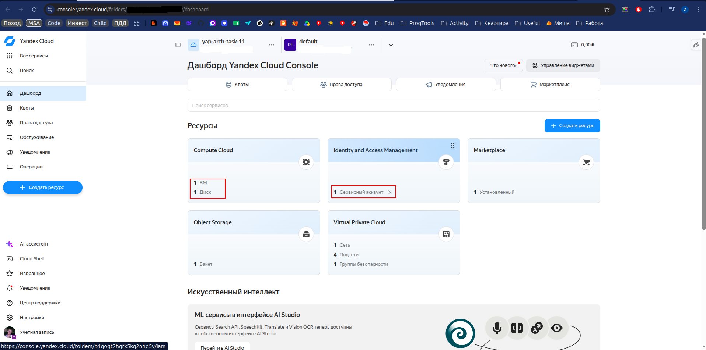
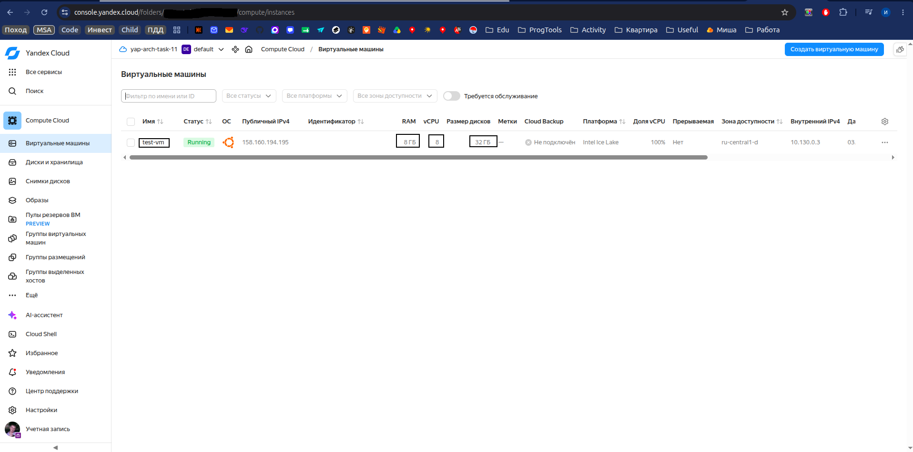
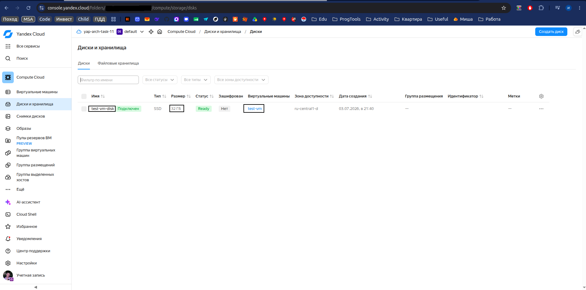

# Задание 1. Модульная инфраструктура для нескольких сред

Для развертывания универсального модуля в Yandex Cloud (YC) необходимо:
- установить локально Terraform,
- зарегистрироваться в YC, создать там организацию и облако,
- произвести начальную [настройку Terraform в YC](https://yandex.cloud/ru/docs/tutorials/infrastructure-management/terraform-quickstart),
- создать/узнать токен доступа:
```bash
# сервисный аккаунт, который необходимо привязать к Yandex-аккаунту
# и наделить админскими правами для редактирования каталога вашего облака
yc iam service-account list
# +----------------------+-----------------+--------+---------------------+-----------------------+
# |          ID          |      NAME       | LABELS |     CREATED AT      | LAST AUTHENTICATED AT |
# +----------------------+-----------------+--------+---------------------+-----------------------+
# | <service-account-id> | service-account |        | 2026-06-26 18:33:14 | 2026-06-27 07:50:00   |
# +----------------------+-----------------+--------+---------------------+-----------------------+

# получить service-account-id (для автоматизации)
yc iam service-account get --format=json --name service-account 2>/dev/null | jq '.id'

# создать токен
yc iam create-token --impersonate-service-account-id <service-account-id>
# 
# <access_token>

# или получить, если он уже есть
yc iam api-key list --service-account-name <name>
```
- выбрать интересующее окружение и настроить файл *.tfvars в выбранной папке:
  - [dev](./envs/dev/values.tfvars),
  - [stage](./envs/stage/values.tfvars),
  - [prod](./envs/prod/values.tfvars),
- при выяснении данных для заполнения можно использовать web-интерфейс YC воспользоваться командой :
```bash
yc config list
# subject-id: **********************
# username: mail@yandex.ru
# cloud-id: **********************
# folder-id: **********************
# compute-default-zone: ************
```
- развертывание модуля в YC:
```bash
# локально в терминале
cd <env_dir: dev/prod/stage>
export YC_TOKEN="<access_token>"

terraform init
terraform plan -var-file=values.tfvars -state="../../terraform_states/terraform.tfstate"
terraform apply -auto-approve -var-file=values.tfvars -state="../../terraform_states/terraform.tfstate"
```
- при необходимости удалить модуль из YC:
```bash
terraform destroy -auto-approve -var-file=values.tfvars -state="../../terraform_states/terraform.tfstate"
```

Результаты:






