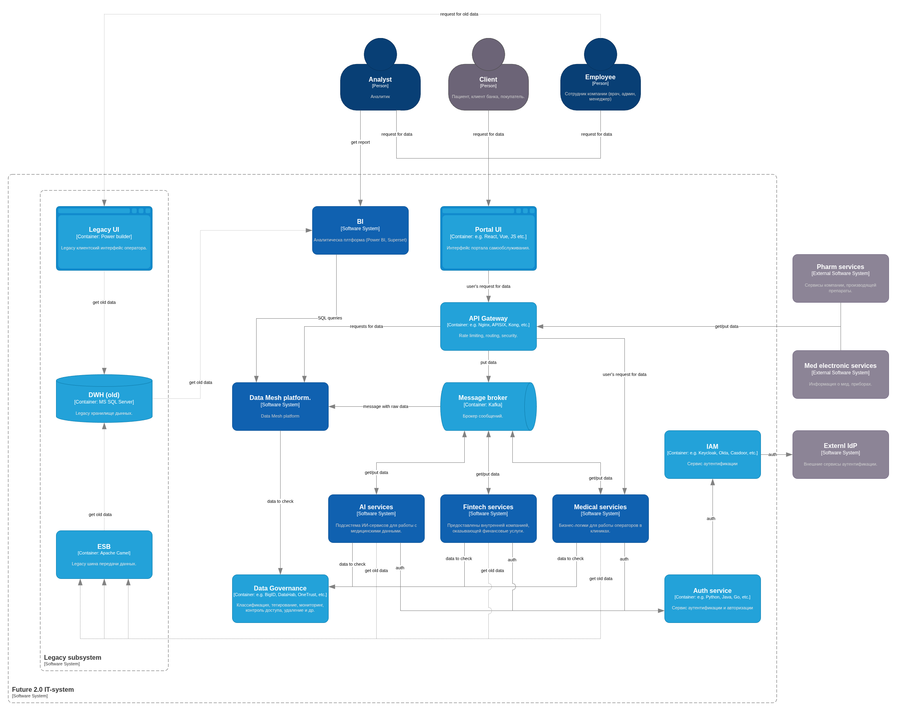
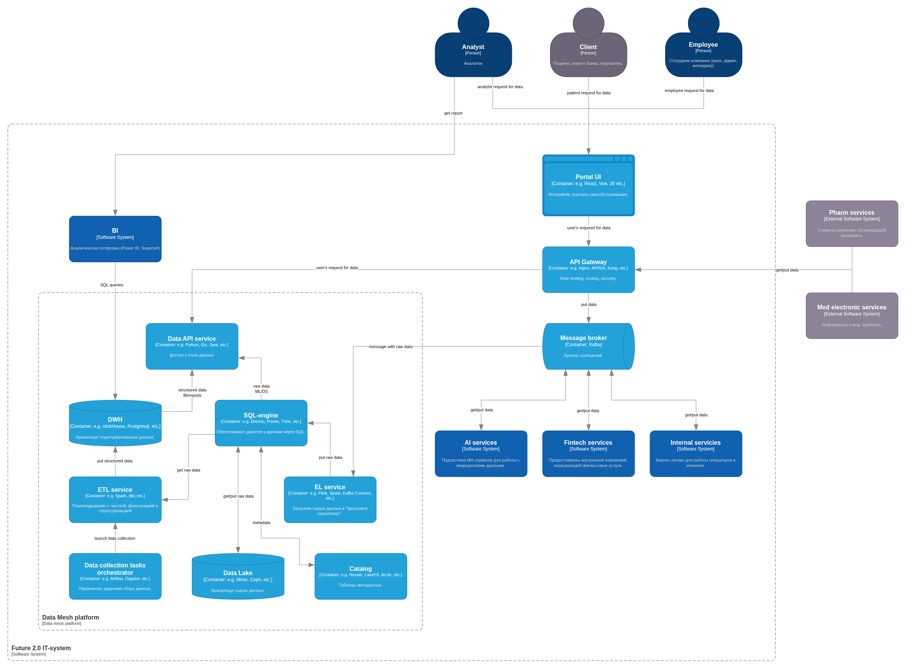

# Задание 3. Проектирование целевой архитектуры и оценка рисков внедрения

## Требования

- Интегрировать в экосистему нескольких фармацевтических компаний и производителя электроники для медицинского оборудования.
- Развивать каждое из своих направлений отдельно, сохраняя при этом целостное представление по ключевым бизнес-показателям.
- Сделать построение необходимой отчётности быстрее, сейчас занимает слишком много времени.
- Объём аналитических данных измеряется сотнями терабайт.
- Большое количество сценариев использования аналитических данных с большим количеством трансформаций.
- Ускорить time-to-market за счет подъёма производительность составления аналитических процессов (формирование сложных отчётов может занимать часы).
- Перенести основную часть своего IT-ландшафта в облачную инфраструктуру с целью:
  - быстрее масштабировать ресурсы для работы с данными,
  - гибко подключать новые бизнес-направления,
  - сократит затраты на поддержку устаревшего оборудования,
  - повысить надёжность и доступность сервисов.
  - отдельные среды для разных доменов, чтобы обеспечить их независимость, упростить развитие.
  - использовать механизмы отказоустойчивости,
  - реализовать резервного копирования,
  - организовать геораспределённого развёртывания.
- В облаке необходимо сохранить:
  - обеспечение информационной безопасности,
  - соблюдение требований регуляторов, особенно в части работы с медицинскими и финансовыми данными.
- Создать удобную «витрину данных» — портала самообслуживания:
  - можно легко масштабировать вне зависимости от количества бизнес-направлений и их целей,
  - сотрудник сможет получить/создать в этой системе отчёт по любым необходимым срезам в пределах своего уровня доступа,
  - не будет использовать для аналитики медицинские карты, истории болезней и результаты медицинских исследований.
- Изменение IТ-ландшафта в области работы с данными должно обеспечить интеграцию новых бизнес-направлений без необходимости вносить значительные объёмы бизнес-логики в DWH.
- При необходимости можно отказаться от legacy-систем и мигрировать на новые сервисы.
- Система должна быть слабосвязанной событийной платформой, в рамках которой домены взаимодействуют через события и реактивные потоки.
- Интеграции через шину Camel и DWH используются только как «мосты совместимости» на этапе миграции.

## Архитектура to-be

Пояснения:
- ИИ-, финтех- и медицинские сервисы считаю частью IT-системы компании.
- Интеграции с фармацевтическими компаниями и производителем медтехники считаю внешними.

Общая диаграмма контейнеров

Основные решения:
- Трансформация текущей работы с данными в Data Mesh платформу.
- EDA на основе Apache Kafka.
- Security на основе Auth service, IAM.
- PbD при помощи  Data Governance системы.
- Единая точка входа в систему: API Gateway.
- Portal как средство доступа к данным для пользователей.

Детализированная диаграмма контейнеров для Data Mesh платформы

Основные характеристики:
- Поток входных данных (put data):
  - Source ->
  - Apache Kafka ->
  - EL service ->
  - Call SQL engine ->
  - Put to the Data Lake ->
  - Notify Catalog.
- Запрос на данные (user's request for data) по цепочке: API Gateway -> Data API service -> Data storages (DWH или Data Lake):
  - Get from Data Lake: Call SQL engine -> Ask Catalog -> Get file from the Data Lake.
  - Get from DWH: Call DWH.
- Data storages:
  - DWH - структурированные данные, доступ через SQL-запросы (собственный движок).
  - Data Lake - исходные данные, доступ через SQL-engine service.
- Внутренняя обработка данных на основе Data collection tasks orchestrator:
  - Extract from Data Lake -> Transform in the task -> Put to the DWH.

## Сценарии масштабирования:
- Добавления тематического направления (домена):
  - группа сервисов подключается к Kafka для получения, выгрузки данных (в дополнение к AI services, Fintech services и другим).
  - горизонтально масштабирование сервисов Data Mesh платформы под предполагаемое увеличение нагрузки.
- Добавление географического направления:
  - добавления дата-центра;
  - шардинг данных;
  - горизонтально масштабирование сервисов под предполагаемое увеличение нагрузки.
- Рост нагрузки:
  - автоматическое горизонтальное масштабирование сервисов пропорционально нагрузке.
- Внешняя интеграция:
  - выдача API keys партнёрам;
  - настройка API Gateway в соответствии с SLA для новой интеграции (Routing, Security, Rate limits);
  - горизонтально масштабирование сервисов под предполагаемое увеличение нагрузки.

## Legacy-подсистема:

- DWH (old)
- ESB (Apache Camel)
- Legacy UI (Power Builder)

Работает на выдачу данных, добавление новых данных блокируется на организационном (инструкции персоналу и админам) и техническом уровнях (feature-flags, политики доступа) в конкретных сервисах.
ACL подготавливаются отдельно на уровне каждого сервиса.

Отключение возможно будет после миграции имеющихся данных и включении в работу новых систем. Для этого нужно будет выставить feature-флаги в сервисах на использование нового функционала.

## Риски

### Архитектурные

| Риск | Вероятность | Ущерб | Меры предотвращения и минимизации ущерба |
|---|---|---|---|
| Неверный выбор технологий (bugs, performance, security) | Низкая  | Средний | Проектирование и анализ  Разработка через MVP и PoC  Микросервисная архитектура со слабыми связями  Миграция на подходящую технологию (Parallel run, Branch by abstraction) |
| Заниженная оценка нагрузки                              | Средняя | Высокий | Оркестратор ресурсов (K8s)  Highload ready software  | 
| Сложная структура взаимодействий в MSA                  | Высокая | Средний | EDA  Code Review  CI pipelines |
| Необходимость интеграции со старыми внешними системами  | Средняя | Низкий  | API Gateway  API слой в микросервисах |

### Организационные

| Риск | Вероятность | Размер ущерба  | Меры предотвращения и минимизации ущерба |
|---|---|---|---|
| Изменения требований регулятора   | Средняя | Высокий | Мониторинг требований  Гибкость архитектуры  |
| Отсутствие специалистов           | Низкая  | Высокий | Планирование потребностей  Найм на ранних стадиях  Использование известных технологий  Переобучение сотрудников |
| Срыв сроков разработки            | Средняя | Средний | Стадии планирования и проектирования  Разработка через MVP и PoC |
| Несогласованность действий команд | Высокая | Средний | Обсуждения планов и презентации результатов  Механизмы прослеживания (Data Governance, Observability)  Разработка через MVP и PoC |
| Сопротивление персонала           | Высокая | Низкий  | Обучение  Ограничение операций с Legacy  Мониторинг|

### Технологические

| Риск | Вероятность | Размер ущерба | Меры предотвращения и минимизации ущерба |
|---|---|---|---|
| Неконсистентность/потеря данных (Legacy vs New) | Высокий | Высокий | Планирование миграции  Мониторинг данных (Data Governance)  Backups  Parallel run |
| Повышенная нагрузка                             | Средняя | Высокий | Автомасштабирование  Highload ready software  Проектирование с учетом Highload  Back-pressure, Rate limitings  Load testing |
| Нарушение требований регулятора                 | Высокая | Высокий | Pbd на ранних стадиях   Мониторинг и аудит (Data Governance)  Выбор подходящего провайдера  Шифрование  |
| Неконсистентность данных между звеньями EDA     | Высокая | Высокий | Шаблоны проектирования: Saga, Transactional Outbox, Event Sourcing  Мониторинг и алертинг |
| Техническая уязвимость                          | Низкая  | Высокий | Обучение сотрудников  Ограничение прав доступа  Мониторинг/аудит  Регулярные обновления ПО  Составление DRP |
| Ошибки в работе ПО                              | Низкая  | Высокий | Тестирование ПО  Мониторинг и алертинг   Оркестратор ресурсов (K8s)  Регулярные обновления ПО  Составление DRP  |
| Vendor lock (Software, Cloud)                   | Высокая | Средний | Vendor agnostic архитектура: Terraform, K8s, контейнеры, общедоступные компоненты (Kafka, Airflow и др) |
| Нарушений SLA на интеграцию                     | Высокий | Средний | API Gateway (back-pressure, rate limitings)  API слой в микросервисах |
| Повышенные расходы на облако                    | Высокий | Средний | Мониторинг расходов  Политики ограничения потребления (requests, limits) |

