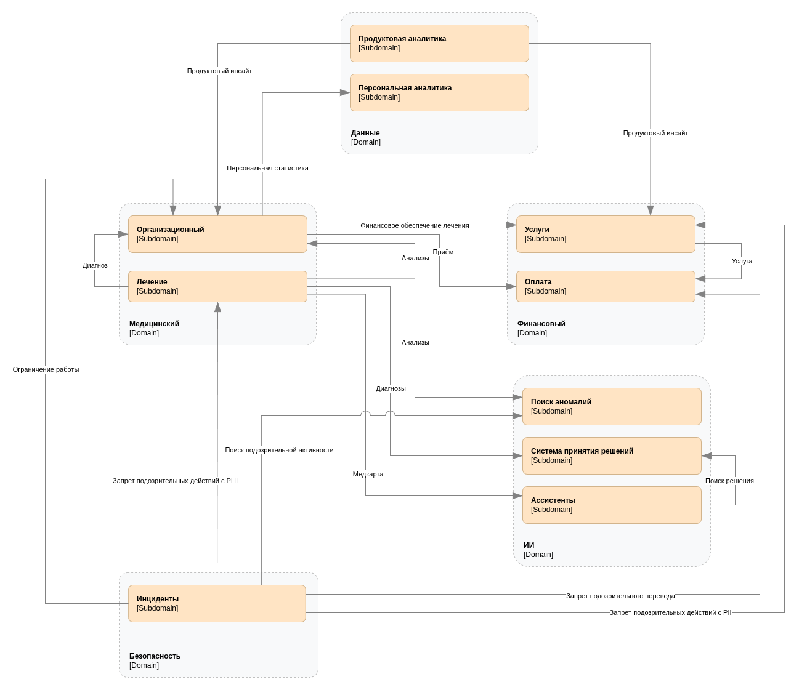

# Bounded context

Домены и поддомены - сущности бизнес-процессов (пространство проблем), а bounded-context-ы - архитектура и код (пространство решений) .Текущая система позволяет добиться идеального варианта, в котором bounded-context-ы один-в-один совпадают с поддоменами (за исключением технических аспектов). Это возможно благодаря тому что:
- текущая архитектура имеет декомпозиция доменов, хорошо согласующуюся с планируемой ([AS-IS архитектура](./arch/as-is-c4-containers.drawio.png));
- мы находимся у истоков трансформации системы и не обременены блокирующими проблемами.

## Context map

