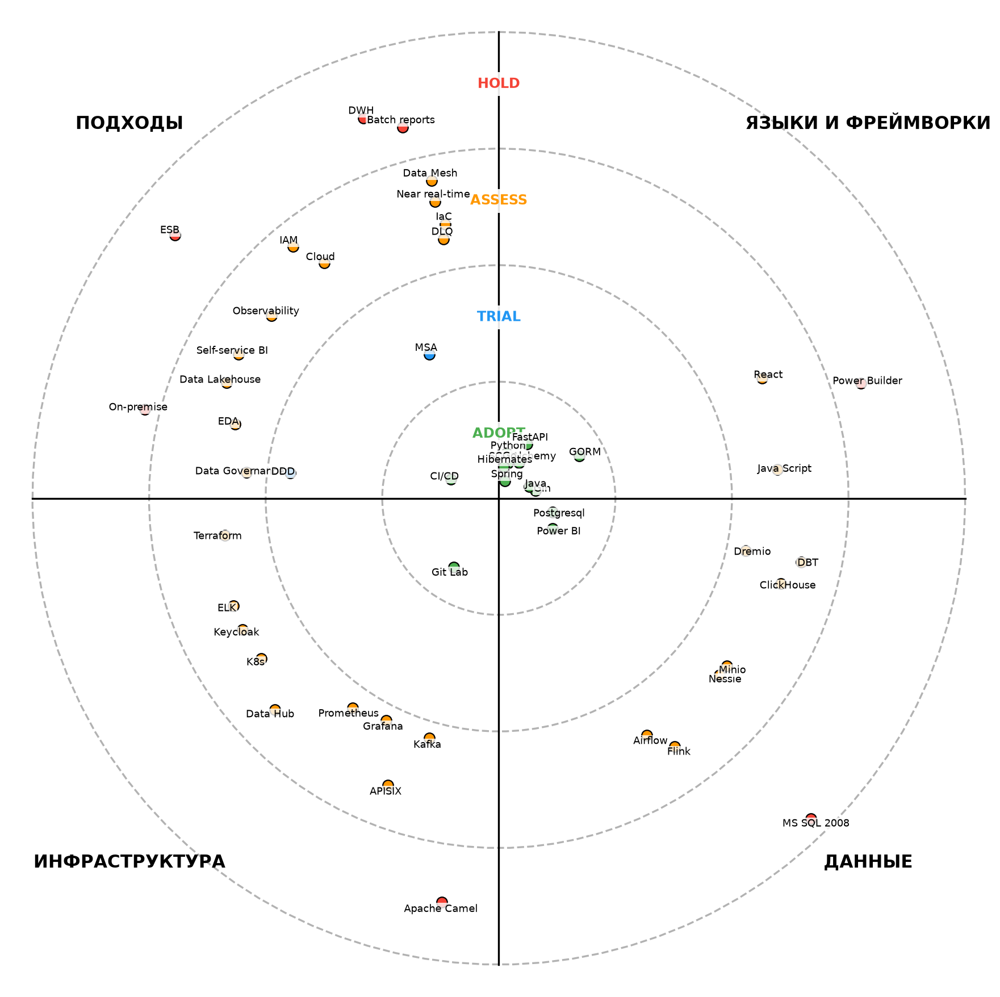

# Задание 5. Проектирование технологического стека и расчёт стоимости

## Технологический радар

| Технология | Состояние | Комментарий |
|---|---|---|
| **Языки и фреймворки** |
| Power Builder               | Hold   | Legacy UI|
| Python                      | Adopt  | ИИ-сервисы |
| FastAPI                     | Adopt  | ИИ-сервисы |
| SQL Alchemy                 | Adopt  | ИИ-сервисы |
| Go                          | Adopt  | Финтех-сервисы |
| Gin                         | Adopt  | Финтех-сервисы |
| GORM                        | Adopt  | Финтех-сервисы |
| Java                        | Adopt  | Финтех-сервисы |
| Spring                      | Adopt  | Финтех-сервисы |
| Hibernates                  | Adopt  | Финтех-сервисы |
| Java Script                 | Assess | Portal |
| React                       | Assess | Portal |
| **Данные** |
| Apache Camel                | Hold   | Legacy ESB |
| MS SQL Server2008           | Hold   | DWH |
| Postgresql                  | Adopt  | ИИ- и финтех-сервисы |
| Power BI                    | Adopt  | Data Lakehouse |
| ClickHouse                  | Assess | OLAP DWH |
| Kafka                       | Assess | EDA |
| Airflow                     | Assess | Data Lakehouse |
| Flink                       | Assess | Data Lakehouse |
| Nessie                      | Assess | Data Lakehouse |
| Minio                       | Assess | Data Lakehouse |
| Dremio                      | Assess | Data Lakehouse |
| DBT                         | Assess | Data Lakehouse |
| **Инфраструктура** |
| Git Lab                     | Adopt  | Явно не упомянут, но предполагаю, что используется |
| K8s                         | Assess | Развертывание в облаке |
| Terraform                   | Assess | Развертывание в облаке |
| APISIX                      | Assess | API Gateway |
| ELK                         | Assess | Observability |
| Grafana                     | Assess | Observability |
| Prometheus                  | Assess | Observability |
| Keycloak                    | Assess | IAM |
| Data Hub                    | Assess | Data Governance |
| **Подходы** |
| ESB                         | Hold   | Legacy |
| DWH                         | Hold   | Legacy |
| Batch data reports          | Hold   | Legacy |
| On-premise                  | Hold   | Legacy |
| MSA                         | Trial  | Целевая архитектура компании должна представлять из себя слабосвязанную событийную платформу |
| DDD                         | Trial  | В облаке предполагается выстраивать отдельные среды для разных доменов |
| Near real-time data reports | Assess | Долгосрочная цель - переход от пакетной отчётности («batch») к near-real-time обработке|
| Data Lakehouse              | Assess | Создать удобную «витрину данных» |
| Data Mesh                   | Assess | Создать удобную «витрину данных» |
| EDA                         | Assess | Целевая архитектура компании должна представлять из себя слабосвязанную событийную платформу |
| Self-service BI             | Assess | Создать удобную «витрину данных» |
| Cloud                       | Assess | В ближайшее время компания планирует перенести основную часть своего IT-ландшафта в облачную инфраструктуру |
| DLQ                         | Assess | Целевая архитектура компании должна представлять из себя слабосвязанную событийную платформу |
| Data Governance             | Assess | Ключевой задачей останется обеспечение информационной безопасности и соблюдение требований регуляторов |
| Observability               | Assess | Построение необходимой отчётности занимает слишком много времени |
| IAM                         | Assess | Ключевой задачей останется обеспечение информационной безопасности и соблюдение требований регуляторов |
| CI/CD                       | Adopt  | Явно не упомянут, но предполагаю, что используется |
| IaC                         | Assess   | Улучшает TTM |

Можно заметить, что в статусе Trial находится лишь MSA и DDD. Это объясняется тем, что в компании давно не производились нововведения. Технологии либо давно и успешно используются (Adopt), либо являются новыми (Assess). Текущая миграция подразумевает довольно радикальные изменения с большим количеством нововведений.

# Total Cost of Ownership

Для построения модели TCO приняты следующие допущения:
- Объём данных: 300 ТБ (активные данные) + 200 ТБ (архив, холодное хранилище)
- Количество аналитиков: 25 человек
- Количество инженеров данных: 15 человек
- Количество DevOps / SRE: 8 человек
- Курс USD: 90 руб.

Ставки специалистов приняты на основе среднерыночных значений:
- аналитик данных — 176 тыс. руб./мес.,
- инженер данных — 200 тыс. руб./мес.,
- DevOps-инженер — 224 тыс. руб./мес.

## Архитектура AS-IS

| Статья расхода | за год, млн.₽ | Всего, млн.₽ |
|---|---|---|
| **Инфраструктура**                   | **34,5** | **103,5** |
| Серверное оборудование (амортизация) |   18,0   |    54,0   |
| СХД                                  |   12,0   |    36,0   |
| Электропитание и охлаждение          |    4,5   |    13,5   |
| **Лицензии**               | **13,74** | **41,22** |
| SQL Server 2008 Enterprise |     9,5   |    28,5   |
| Power BI Pro               |    0,54   |    1,62   |
| PowerBuilder Enterprise    |     1,2   |     3,6   |
| Windows Server             |     2,5   |     7,5   |
| **Зарплата**     | **110,3** | **330,9** |
| Аналитики данных |    52,8   |   158,4   |
| Инженеры данных  |    36,0   |   108,0   |
| DevOps / SRE     |    21,5   |    64,5   |
| **Простои и потеря производительности** | **8,3** | **24,9** |
| Потери от простоя1     | 5,3 | 15,9 |
| Инфраструктурные простои (оценка) |   3 |    9 |
| **Итого** | **166,84** | **500,4** |

1 - потери от часовых отчётов (25 аналитиков × 10% времени ожидания)

## Архитектура TO-BE

### Расходы на облако

Сопоставление возможностей Yandex Cloud с технологическим радаром.

| Технология | Реализация в целевой архитектуре |
|---|---|
| PostgreSQL | Managed PostgreSQL — оперативная БД |
| ClickHouse | Managed ClickHouse — OLAP-витрина |
| Kafka | Managed Kafka — событийная платформа |
| Flink | Yandex Data Proc — потоковая обработка |
| MinIO | Yandex Object Storage (S3-совместимое) — Data Lakehouse |
| K8s | Managed Kubernetes — оркестрация контейнеров |
| Terraform | Yandex Cloud Terraform Provider — IaC |
| Другие сервисы | Self-managed на Yandex Managed K8s |

TCO облачной инфраструктуры.

| Сервис | Конфигурация | Стоимость в месяц, руб. | Стоимость в год, млн руб. |
|---|---|---|---|
| Yandex Object StorageManaged      | 300 ТБ × ~1500 руб./ТБ + 200 ТБ × холодное хранилище | 750 000 | 9,0 |
| Managed ClickHouseManaged         | 3 хоста: 16 vCPU, 64 GB RAM, 2 ТБ SSD | 350 000 | 4,2 |
| Managed PostgreSQLManaged         | 2 хоста: 8 vCPU, 32 GB RAM, 1 ТБ SSD | 120 000 | 1,44 |
| Managed KafkaManaged              | 3 брокера: 4 vCPU, 16 GB RAM | 90 000 | 1,08 |
| Managed K8sManaged                | Региональный мастер + узлы | 80 000 | 0,96 |
| Data ProcManaged                  | 5 узлов: 8 vCPU, 32 GB RAM (preemptible, экономия до 70%) | 60 000 | 0,72 |
| Compute CloudManaged              | API Gateway, Portal, Airflow, Keycloak, Observability | 200 000 | 2,4 |
| Резервное копирование + DRManaged | Геораспределённое копирование | 150 000 | 1,8 |
| Исходящий трафикManaged           | Первые 100 ГБ/мес бесплатно, свыше — 7,65 руб./ГБ | 50 000 | 0,6 |
| **Итого**                         | | **1 880 000** | **22,6** |

### Расходы на лицензии (облачные / SaaS)

| Статья расхода                                      | за год, млн.₽ | за 3 года, млн.₽ |
|---|---|---|
| Power BI Pro (25 пользователей × $14/мес × 90 руб.) |   0,38   |   1,14   |
| **Итого**                                           | **0,38** | **1,14** |

### Расходы на зарплату

| Роль | Кол-во | Ставка, тыс. руб./мес. | Ежегодно, млн руб. | 3 года, млн руб. |
|---|---|---|---|---|
| Аналитики данных (самообслуживание)            |   25   | 176 |   52,8  | 158,4   |
| Инженеры данных (платформа)                    |   10   | 200 |   24,0  |  72,0   |
| DevOps / SRE (облачная инфраструктура)         |    5   | 224 |   13,44 | 40,32   |
| Архитекторы данных (платформенная команда)     |    2   | 280 |    6,72 | 20,16   |
| Data Product Owner (управление доменами)       |    1   | 220 |    2,64 |  7,92   |
| Data Steward                                   |    1   | 200 |   24,0  |  7,2    |
| **Итого**                                      | **44** |     | **102** | **306** |

### Расходы на миграцию (единовременные)

| Статья расхода | Стоимость, млн руб. |
|---|---|
| Архитектурное проектирование                                |    8,0   |
| Разработка антикоррупционных слоёв (Camel → Kafka)          |   12,0   |
| Миграция DWH → Data Lakehouse (ClickHouse + Object Storage) |   10,0   |
| Обучение персонала (Data Mesh, EDA, Yandex Cloud)           |    4,0   |
| Пилотные проекты (2 домена)                                 |    6,0   |
| **Итого миграция**                                          | **40,0** |

### Итоговые расходы

Предполагает период параллельной работы двух систем в первые 6 месяцев месяца старая и новая системы работают одновременно.

Поэтапное развёртывание:
  - в пилотный период (первые 6 месяцев) используется только 30% облачных мощностей;
  - персонал (инженеры, архитекторы, DPO) нанимается с первого дня в полном объёме.

| Категория расхода            |  1-6 месяцы (пилот) |   7-12 месяцы (две системы) |    2-й год  |   3-й год  | Всего за 3 года |
|---|---|---|---|---|---|
| Старая система               |          83,4       |                 0          |         0   |       0    |      **83,4**   |
| Облачная инфраструктура      |          3,39       |              11,3          |      22,6   |    22,6    |      **67,8**   |
| Лицензии                     |          0,19       |              0,19          |      0,38   |    0,38    |      **1,14**   |
| Персонал (скорректированный) |           51        |               51           |       102   |     102    |     **298,8**   |
| Миграционные затраты         |          20,0       |              20,0          |         0   |       0    |      **40,0**   |
| **Итого**                    |      **157,98**     |           **82,49**        |  **124,98** | **124,98** |    **489,34**   |

## Сравнение TCOas-is и TCOcloud

| Показатель | TCOas-is | TCOcloud | Разница |
|---|---|---|---|
|        1-й год      |   166,8   |   240,47   | **+73,67** |
|        2-й год      |   166,8   |   124,98   | **−41,82** |
|        3-й год      |   166,8   |   124,98   | **−41,82** |
| **Всего за 3 года** | **500,4** | **489,34** | **−11,06** |

**Выводы**:
- В первый год ожидается повышенный расход за счет: миграции и параллельной работы систем.
- В течении 3 лет новая архитектура окупит затраты за счет:
  - уменьшения расходов на инфраструктуру,
  - меньшего числа сотрудников (благодаря облачной автоматизации),
  - уменьшения лицензионных отчислений.
- Ускорение time‑to‑market для новых отчётных форм (с часов до минут).
- Возможность near‑real‑time аналитики для новых бизнес-кейсов.
- Соответствие регуляторным требованиям (152‑ФЗ, PCI DSS) за счёт Yandex Cloud.
- Готовность к масштабированию на новые регионы и продукты без перестройки ядра.

# Roadmap

## Ключевые роли

| Роль | Ответственность |
|---|---|
| Data Product Owner      | Отвечает за Data Product-ы (качество, поддержка, развитие) |
| Архитектор данных       | Определяет архитектуру Data-платформы, инструменты контроля качества и средства работы с данными |
| Data Engineer           | Реализует и поддерживает пайплайны данных (Kafka, Nessie, Dremio, Airflow), создает витрины |
| Data User / BI-аналитик | Работает с дынными через интерфейс (портал / Power BI) |
| Data Steward            | Отвечает за процессы с данными (Data Governance) |

## Этап 1: 1 - 6 месяц (пилотный проект)

### Фаза 1: 1 - 2 месяц

Бизнес-цели:
- Архитектурное решение по трансформации сформировано и согласовано.
- Границы доменов определены, а ключевые связи между ними описаны.
- В доменах запланированы конкретные проекты по развитию «витрины данных».
- Вводятся антикоррупционные слои для интеграций через Camel и DWH.

Работы:
- Выработка стандартов архитектурной документации.
- Реализация ACL.
- Создание архитектурного проекта Data-платформы.
- Создание архитектурных проектов Data Products в медицинском и финансовых доменах.
- Разворачивание инфраструктуры: Yandex Cloud, Terraform, K8s, Kafka, API Gateway, services.
- Старт работ над Data Product-ом в домене "Финансовый.Услуги".
- Найм и обучение.

### Фаза 2: 3 - 4 месяц
Бизнес-цели:
- Единые принципы работы с событиями с очередями DLQ и каталогом схем.
- Пилот в финансовых расчётах.

Работы:
- Развертывание инфраструктуры Data-платформы: ClickHouse, Flink, MinIO, Nessie, Airflow, Dremio, DBT.
- Документация по работе с Data-платформой и потоками данных.
- Релиз Data-платформы в режиме MVP.
- Релиз Data Product-а в домене "Финансовый.Услуги".
- Старт работы над Data Product-ом в домене "Медицинский.Организационный".

### Фаза 3: 5 - 6 месяц
Бизнес-цели:
- Пилот в пациентский поток.
- На этом этапе допускается временное сохранение легаси-систем в отдельных доменах.

Работы:
- Разворачивание :
  - Data Governance(DataHub),
  - Observability(ELK, Grafana, Prometheus),
  - IAM.
- Релиз Data Product-а в домене "Медицинский.Организационный".
- Старт работы над порталом.

## Этап 2: 6 - 18 месяц

### Фаза 1: 7 - 12 месяц
Бизнес-цели:
- Реализован портал самообслуживания.
- Бизнес-пользователи в доменах могут работать с данными в рамках новой архитектуры.

Работы:
- Релиз портала.
- Отключение старой системы.
- Старт работ над Data Product-ом в домене Медицинский.Лечение.
- Старт работ над Data Product-ом в домене Финансовый.Оплата.
- Создание архитектурных проектов на:
  - новый финтех-сервис,
  - медицинский сервис,
  - сервис монетизацию ИИ-функций.

###  Фаза 2: 12 - 18 месяц
Бизнес-цели:
- Трансформация расширяется на критические домены.
- Запускаются потоковые витрины.

Работы:
- Релиз Data Product-а в домене Медицинский.Лечение.
- Релиз Data Product-а в домене Финансовый.Оплата.
- Старт работ над:
  - новым финтех-сервисом,
  - новым медицинскими сервисами,
  - сервисом монетизацией ИИ-функций.

## Этап 3: 18 - 36 месяц

### Фаза 1: 18 - 24 месяц
Бизнес-цели:
- Продукты: запуск новых финтех- и медицинских сервисов, монетизация ИИ-функций.

Работы:
- Релизы:
  - новый финтех-сервис,
  - медицинский сервис,
  - сервиса монетизация ИИ-функций.
- Подготовка перехода Data-платформы в потоковый режим.
- Архитектурный проект гео-распределения облака.

### Фаза 2: 24 - 30 месяц
Бизнес-цели:
- Данные: увеличение количества источников и событий, переход от пакетной отчётности («batch») к near-real-time обработке.
- Отказ от точечных синхронных интеграций на критическом пути и переход к доменной аналитике на основе потоков данных. 

Работы:
- Перехода Data-платформы в потоковый режим для обеспечения near-real-time обработки.
- Старт работ над гео-распределением.
- Проведение аудита безопасности перед выходом в новые регионы.

### Фаза 3: 30 - 36 месяц
Бизнес-цели:
- География: выход на два-три новых региона с учётом локальных требований.

Работы:
- Реализация гео-распределения с выходом в новые регионы.